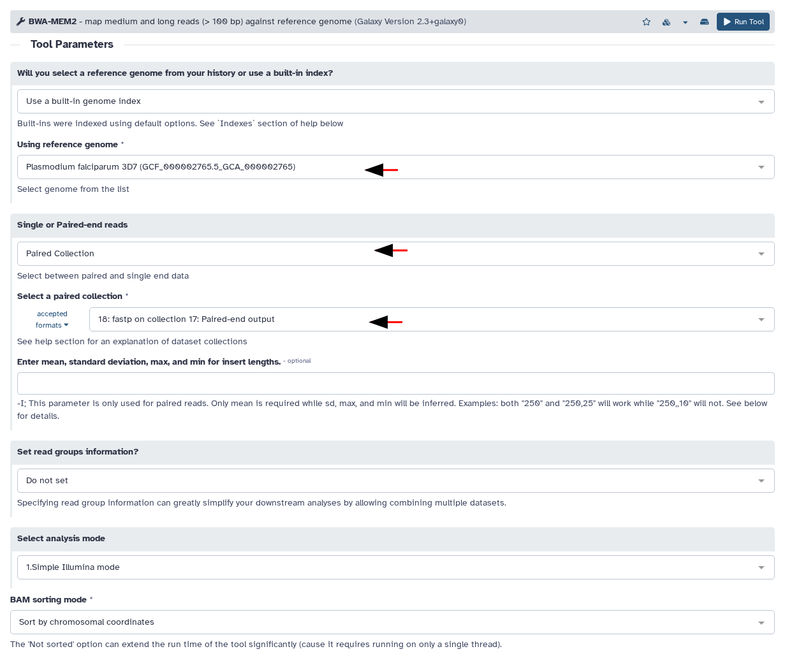

# GTN Tutorial Generator

Generate [Galaxy Training Network](https://training.galaxyproject.org) tutorials automatically from Galaxy history URLs.

## What It Does

Given a Galaxy history URL, this tool:
1. Extracts all executed tool jobs from the history
2. Fetches exact parameters used for each tool
3. Generates screenshots of each tool form with correct settings
4. **Annotates screenshots** with arrows highlighting parameters changed from defaults
5. Produces a complete `tutorial.md` in GTN kramdown format

## Quick Start

```bash
# Install
npm install
npm run build

# Create API key files
echo "your-galaxy-api-key" > .galaxy-api-key
echo "sk-ant-api03-..." > .anthropic-api-key

# Generate tutorial
node dist/cli.js from-history \
  -h "https://usegalaxy.org/u/username/h/history-slug" \
  --username your@email.com \
  --password yourpassword \
  --generate
```

## CLI Options

```
-h, --history <url>     Galaxy history URL (required)
-o, --output <dir>      Output directory (default: ./output)
--username <user>       Galaxy username for browser login
--password <pass>       Galaxy password for browser login
--api-key <key>         Galaxy API key (for REST API calls)
--anthropic-key <key>   Anthropic API key (for AI text generation)
--generate              Generate full tutorial with screenshots
--config-only           Only generate config YAML, skip tutorial
```

## How It Works

### Data Flow

```
History URL
     ↓
┌─────────────────────────────────────────────────┐
│  1. Fetch history metadata + jobs               │
│     GET /api/histories/published?slug=X         │
│     GET /api/jobs?history_id=X                  │
└─────────────────────────────────────────────────┘
     ↓
┌─────────────────────────────────────────────────┐
│  2. Get full params for each job                │
│     GET /api/jobs/{id}?full=true                │
│     → Returns all tool settings                 │
└─────────────────────────────────────────────────┘
     ↓
┌─────────────────────────────────────────────────┐
│  3. Generate screenshots (Playwright)           │
│     Open tool in job rerun mode                 │
│     → ?tool_id=X&job_id=Y                       │
│     Form pre-filled with exact params           │
└─────────────────────────────────────────────────┘
     ↓
┌─────────────────────────────────────────────────┐
│  4. Write GTN markdown                          │
│     Frontmatter + hands-on sections             │
│     One section per tool                        │
└─────────────────────────────────────────────────┘
     ↓
   tutorial.md + images/
```

### Screenshot Generation

The tool uses **job rerun mode** (`?tool_id=X&job_id=Y`) to open tool forms with exact parameters pre-filled from the original execution.

**For map-over tools** (tools that ran on collection elements):
- Galaxy shows individual element name (e.g., "SRR123_R1.fastq")
- We replace displayed text with collection name (e.g., "17: data")
- Uses DOM manipulation to find "(as dataset collection)" marker

**For single-job tools** (tools that took a collection directly):
- Job rerun shows correct collection input when logged in as history owner
- Falls back to dropdown selection if needed

### Automatic Parameter Annotations

Screenshots are automatically annotated to highlight parameters that differ from tool defaults:



**How it works:**
1. Fetches tool schema from `/api/tools/{id}/build` to get default values
2. Compares job parameters against defaults using `/api/jobs/{id}/parameters_display`
3. Identifies changed parameters (accounting for value/label format differences)
4. Draws red arrows pointing to each changed field
5. Adds a "Key parameters to change" comment box listing all changes

**Generated markdown:**
```markdown
> > <comment-title>Key parameters to change</comment-title>
> >
> >    - *"Using reference genome"*: `GCF_000002765.5`
> >    - *"Single or Paired-end reads"*: `paired_collection`
> {: .comment}
>
> 
```

This helps tutorial users immediately see which settings need attention vs. which can be left at defaults.

### API Endpoints Used

| Endpoint | Purpose |
|----------|---------|
| `GET /api/histories/published?slug=X` | Resolve published history URL to ID |
| `GET /api/jobs?history_id=X` | Get all executed jobs in history |
| `GET /api/jobs/{id}?full=true` | Get full job parameters |
| `GET /api/jobs/{id}/parameters_display` | Get human-readable parameter labels/values |
| `GET /api/datasets/{id}/parameters_display` | Get input collection references |
| `GET /api/tools/{id}/build` | Get tool form schema (defaults + options) |

### Collection Job Deduplication

When a tool runs on a collection, Galaxy spawns **multiple jobs** (one per element). The tool:
1. Groups jobs by `tool_id`
2. Takes first job from each group
3. Detects collection inputs via `"src": "dce"` in params
4. Resolves element back to parent collection for display

## Architecture

```
src/
├── cli.ts                      # CLI entry point
├── galaxy/
│   ├── client.ts               # Playwright browser automation
│   ├── history-client.ts       # History/Jobs REST API
│   ├── job-params.ts           # Job parameter extraction
│   ├── form-mapper.ts          # Tool form schema parsing
│   └── api-key-loader.ts       # Load keys from files
├── tutorial/
│   ├── history-converter.ts    # History → TutorialConfig
│   ├── generator.ts            # Config → Markdown + Screenshots
│   ├── ai-generator.ts         # AI explanations (Anthropic)
│   └── types.ts                # TypeScript types
└── capture/
    └── annotate.ts             # Image annotations (boxes, arrows)
```

### Key Components

**HistoryConverter** (`src/tutorial/history-converter.ts`)
- Parses history URL (published or direct)
- Fetches jobs via REST API
- Groups jobs by tool, resolves collection inputs
- Builds TutorialConfig with sections

**TutorialGenerator** (`src/tutorial/generator.ts`)
- Orchestrates screenshot + markdown generation
- Opens tools in Playwright browser
- Calls AI for explanations (optional)
- Writes tutorial.md and images

**GalaxyClient** (`src/galaxy/client.ts`)
- Playwright-based browser automation
- Login (username/password or API key)
- Tool form navigation and manipulation
- Screenshot capture

**JobParamsClient** (`src/galaxy/job-params.ts`)
- Fetches full job params from `/api/jobs/{id}?full=true`
- Parses JSON-stringified parameter values
- Extracts input dataset/collection references

## Internal Tools Filtered

These workflow infrastructure tools are excluded from tutorials:
- `__MERGE_COLLECTION__`, `__RELABEL_FROM_FILE__`, `__FLATTEN__`
- `map_param_value`, `pick_value`, `compose_text_param`
- Any tool starting with `__`
- Jobs with `state: skipped` or `state: error`

## Troubleshooting

### "Found N datasets, 0 jobs"
The history URL may be wrong or API key lacks access. Test:
```bash
curl -H "x-api-key: YOUR_KEY" \
  "https://usegalaxy.org/api/jobs?history_id=YOUR_HISTORY_ID"
```

### "(unavailable)" in screenshots
You're not logged in as the history owner. Use `--username` and `--password` for full access to datasets.

### Tool form timeout
Galaxy server slow or tool ID changed. Verify tool exists on target Galaxy.

### Missing AI text
Set `ANTHROPIC_API_KEY` env var or create `.anthropic-api-key` file.

## Dependencies

- `playwright` - Browser automation (headless Chromium)
- `sharp` - Image manipulation
- `yaml` - YAML parsing
- `commander` - CLI framework
- TypeScript 5.3+, Node.js 20+

## License

MIT
