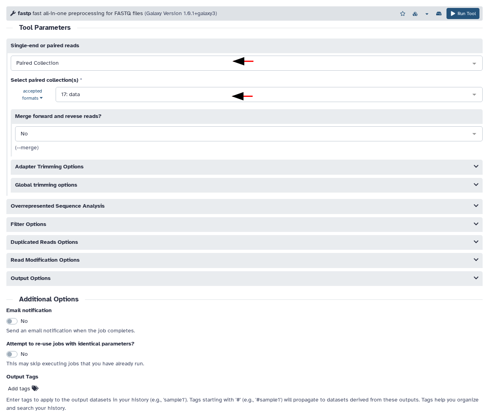
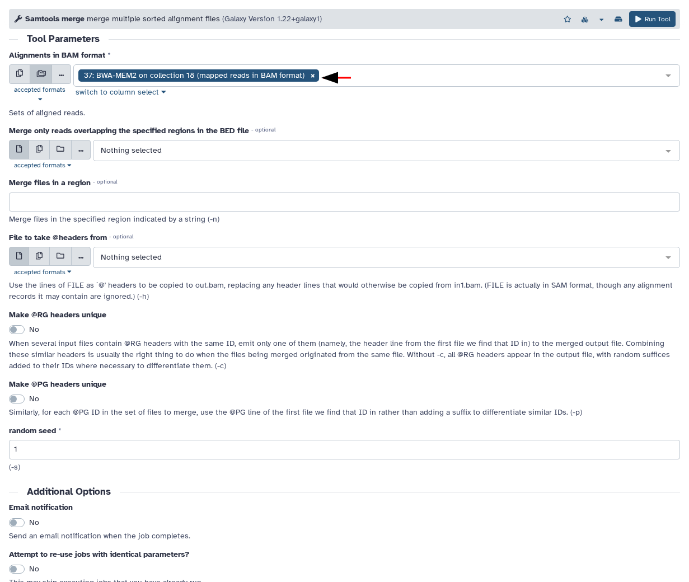

## Introduction

This tutorial was generated from Galaxy history "Unnamed history". It shows the 3 tools that were executed and their settings.

> <agenda-title></agenda-title>
>
> In this tutorial, we will cover:
>
> 1. TOC
> {:toc}
>
{: .agenda}

## fastp

> <hands-on-title>fastp</hands-on-title>
>
> The **fastp** tool performs quality control and preprocessing on raw sequencing reads, automatically trimming low-quality bases, removing adapters, and filtering out poor-quality reads to improve downstream analysis accuracy. We're using the `single_paired: 17: data` parameter to specify that we're processing the paired-end sequencing dataset (dataset 17) as input for quality trimming and filtering.
>
> 1. **fastp**  with the following parameters:
>    - *"single_paired"*: `17: data`
>
> > <comment-title>Key parameters to change</comment-title>
> >
> >    - *"Single-end or paired reads"*: `paired_collection`
> >    - *"Select paired collection(s)"*: `17: data`
> {: .comment}
>
> 
{: .hands_on}

## bwa_mem2

> <hands-on-title>bwa_mem2</hands-on-title>
>
> The **bwa_mem2** tool aligns the quality-trimmed paired-end reads (from the previous fastp step) to a reference genome using the BWA-MEM2 algorithm, which is an improved version of BWA-MEM that provides faster alignment speeds while maintaining accuracy. This alignment step maps each sequencing read to its most likely position in the reference genome, creating the foundation for downstream variant calling and genomic analysis.
>
> 1. **bwa_mem2**  with the following parameters:
>    - *"fastq_input"*: `18: fastp on collection 17: Paired-end output`
>
> > <comment-title>Key parameters to change</comment-title>
> >
> >    - *"Using reference genome"*: `GCF_000002765.5`
> >    - *"Single or Paired-end reads"*: `paired_collection`
> >    - *"Select a paired collection"*: `18: fastp on collection 17: Paired-end output`
> {: .comment}
>
> 
{: .hands_on}

## samtools_merge

> <hands-on-title>samtools_merge</hands-on-title>
>
> The **samtools_merge** tool combines multiple BAM files into a single merged BAM file, consolidating all the mapped reads from the BWA-MEM2 alignment step. We're merging the 37 individual BAM files from collection 18 to create one comprehensive file containing all mapped reads, which simplifies downstream analysis and reduces the number of files to manage in subsequent workflow steps.
>
> 1. **samtools_merge**  with the following parameters:
>    - *"bamfiles"*: `37: BWA-MEM2 on collection 18 (mapped reads in BAM format)`
>
> > <comment-title>Key parameters to change</comment-title>
> >
> >    - *"Alignments in BAM format"*: `37: BWA-MEM2 on collection 18 (mapped reads in BAM format)`
> {: .comment}
>
> 
{: .hands_on}

## Conclusion

You have successfully completed the analysis workflow.